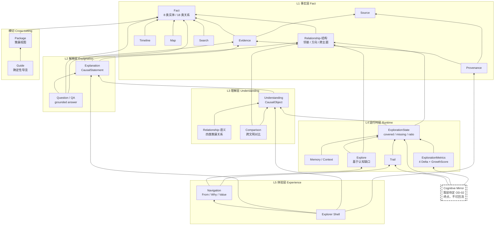
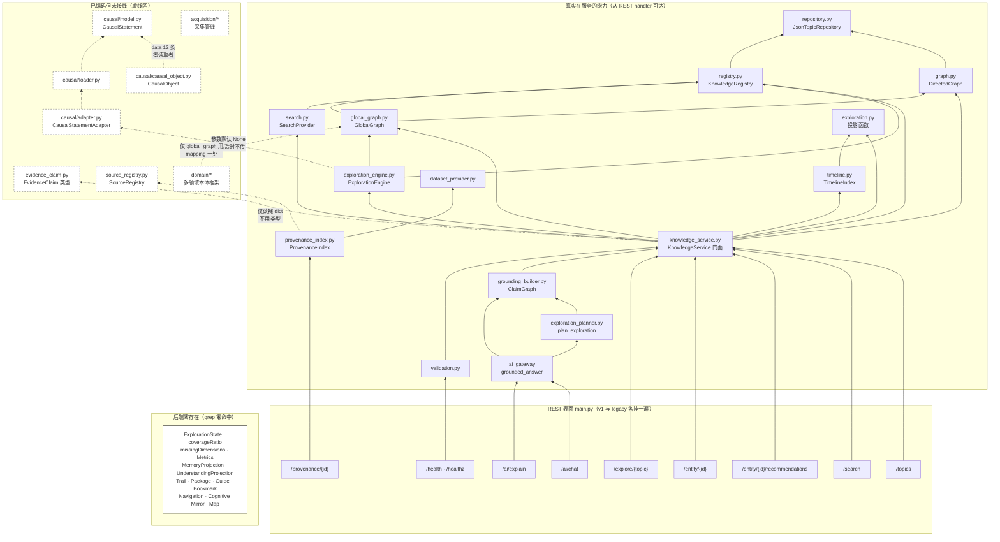

# P1-04 Capability Dependency — 能力依赖图

> FRW Phase 1 Capability Validation · Task 4
> 作者：架构师
> 日期：2026-08-07
> 依据：FRW-Phase0-ProductDiscovery-v2 §3.1 五层模型 / ADR-0013 / Product_Constitution v2.0
> 核查方式：实地阅读后端调用链与构造函数装配关系，依赖边以真实 import / 调用为准。

---

## 0. 读图须知

本文档画两张图，因为它们**结论完全不同**：

- **图 A 契约依赖图**：文档承诺的能力结构。用于判断"能力集是否自洽"。
- **图 B 实际依赖图**：`backend/app` 真实存在的调用链。用于判断"哪些依赖只是纸面上的"。

依赖边的判定标准（严格）：
- **实线** = 代码里真实存在的调用或 import，且在服务路径上（从某个 REST handler 可达）。
- **虚线** = 代码存在但未接线（构造函数参数为 None、数据无读取者、仅测试引用）。
- **无边** = 该能力不存在。

**不把"文档说 A 依赖 B"当作依赖边。**

---

## 1. 图 A — 契约依赖图（文档承诺的结构）



**图 A 的四条结构性约束**（箭头方向即"依赖谁"，反向即"数据流向"）：

1. **Fact 是唯一根**。所有能力最终依赖 Fact，Fact 不依赖任何能力。
2. **L(n) 只连 L(n-1)**。图中不存在 L4 直连 L1 的边——L3→L4 必经 Projection（M89.0）。
3. **L4→L5 只读**。SHELL 指向 L4，没有反向边。
4. **Mirror 只有出边指向 L4，没有任何能力指向 Mirror**。这是 ADR-0013 D3 的图论表达：Mirror 的入度为 0（作为被依赖方），即它不被任何决策消费。**在依赖图上，Mirror 必须是叶子。**

---

## 2. 图 B — 实际依赖图（backend/app 真实调用链）



### 2.1 图 B 的关键读数

**装配根只有一个**：`main.py:87-104`。

```
JsonTopicRepository(data/examples)
  └─> KnowledgeService
        ├─> KnowledgeRegistry
        ├─> KnowledgeGraph        (per-topic)
        ├─> GlobalGraph           (cross-topic)
        ├─> ExplorationEngine(gg, registry, datasets)   ← causal_adapter 缺省 None
        ├─> SearchProvider
        ├─> TimelineIndex × 9
        ├─> evidence_claims.json  (76, 裸 dict)
        └─> sources.json          (43, 裸 dict)
build_dataset_provider(...) └─> ProvenanceIndex   (受 PROVENANCE_PROJECTION 开关)
build_global_validation_report(knowledge_service)
```

装配根里**没有出现**：`CausalLoader`、`CausalStatementAdapter`、任何 CausalObject 读取、任何 ExplorationState、任何 Package/Guide/Trail。

**因此可以下一个硬结论**：本产品服务端真实运行的能力图，是**一张 L1 单层图加一个打分器**。L2/L3 在图上存在节点，但没有入边连到服务路径。

---

## 3. 依赖分类

### 3.1 独立能力（不依赖任何其它能力，只依赖数据）

| 能力 | 依赖 | 判定 |
|------|------|------|
| Fact | 仅 `data/examples/*.json` | 真正的根。删掉它一切归零 |
| Source | 仅 `data/sources.json` | 独立实体，设计上明确"永不进图"，因此不依赖 Fact |

只有这两个。**Source 的独立性是刻意设计**（`source_registry.py` 文件头：Option A，independent entity referenced by id, never a graph node），这个设计是对的——它让来源体系可以独立演进而不冲击 18 类关系冻结。

### 3.2 不可删除能力（删掉后产品定义即崩塌）

判定标准不是"多少代码依赖它"，而是"删掉后 Article 0 三句话中哪一句落空"。

| 能力 | 支撑的定位句 | 删掉的后果 |
|------|------------|-----------|
| **Fact** | ①③ | 无事实 = 无产品。也是③"逼近真相"的物理前提 |
| **Relationship-结构** | ① | 历史退回孤立条目。宪法 2.1「History Is Connected」直接失效，产品变百科 |
| **Explanation** | ① | 只有关系没有因果 = M81a 实测的**最强失败点**（"只标关系不给因果"）。第一句"形成理解结构"落空 |
| **Understanding** | ① | 无"这对我为什么重要" = 探索无终点，退回知识图谱查看器 |
| **Explore** | ①② | 无"下一步" = 一次性阅读器。同时②的方法自生成失去载体 |
| **Memory / Context** | ①② | 无跨会话累积 = 每次从零。continuityScore 失效，第二句的"累积"无处附着 |
| **Evidence + Source + Provenance** | ③ | 三者是第三句的**唯一底座**。删任一，"无限逼近真相"变成空话 |
| **Cognitive Mirror** | ② | **第二句唯一的承载能力**。删掉则三层定位塌成两层，Article 0 明文"三层缺一不可"直接违宪 |

**共 9 项不可删除。** 其中 Cognitive Mirror 当前**实现为零**——即产品有一条宪法级不可删除能力处在"不存在"状态。这不是缺口，是结构性失衡。

### 3.3 可删除 / 可降级能力

| 能力 | 判定 | 理由 |
|------|------|------|
| **Recommendation** | **必须删除** | 违反 M88.0。且它当前占据了 Explore 的位置，不删则 Explore 无法正确实现。详见 P1-05 |
| **Bookmark** | 可删除 | 全栈零实现，且"收藏"是内容 App 的能力形态。与"认知结构增长"的价值定义不吻合。留空不影响任一定位句 |
| **Map** | 可降级为后置 | 四元素等维是 PRD v1.0 的承诺，但空间维度对三层定位的支撑最弱。43 个坐标可以先躺着 |
| **Package** | 可降级 | 它是 Fact 之上的策展视图，删掉不影响能力完整性，只影响"上手速度"。当前形态（前端静态 import）本就不是能力 |
| **Guide** | 依赖 Package，同降级 | 但注意：Guide 是**唯一明确禁个性化的导航形态**。若删 Guide 又不做 Explore，导航真空会被 Recommendation 填补 |
| **`/ai/chat`** | 必须删除其一 | 与 `/ai/explain` 字面同一实现，属能力双名 |
| **legacy_router 全套** | 可删除 | 10 个 handler 各挂两遍，纯兼容负担，无能力含义 |
| **`acquisition/*`** | 存疑 | 采集管线，服务路径不可达。是"未来能力"还是"死代码"待定 |
| **`domain/*` 多领域框架** | **不可删除但当前不可用** | 它是 Supplement A 跨学科愿景（OD-05）的唯一架构承接点。当前只被 `global_graph.py` 用了一处 mapping。删掉则未来愿景无落点 |

### 3.4 依赖别人但被过度依赖的能力（架构风险点）

**`KnowledgeService` 是唯一的门面，被 5 个端点直接依赖，聚合了 7 个子模块。**

它自述"deliberately holds no graph-building, indexing or traversal algorithm of its own, so it never becomes a God Service"（文件头）。这个自律是有效的——它确实只做委托。但它同时暴露了 **30+ 个公共方法**，涵盖 topic / entity / graph / global graph / cross-topic / exploration / recommendation / timeline / search / claims / sources 十个关注点。

**风险判定**：它现在不是 God Service（无算法），但它是 **God Interface**（无边界）。任何新能力都会本能地挂到它上面。重构时若不切分，L2/L3/L4 接线时它会迅速膨胀成真正的 God Service。

**建议（供 Phase 2 参考，不在本阶段决策）**：按层切分为 FactFacade / ExplanationFacade / RuntimeFacade 三个门面，而不是继续往一个类上加方法。

---

## 4. 关键依赖断点（本次核查的核心发现）

依赖图上有 4 处"应该连但没连"的断点。每一处都让上层能力失去支撑。

### 断点 1：ExplorationEngine ↛ CausalStatementAdapter

```
应有：ExplorationEngine ──> CausalStatementAdapter ──> CausalStatement (L2)
实际：ExplorationEngine.__init__(causal_adapter=None)     ← 默认 None
      KnowledgeService 构造时不传该参数（knowledge_service.py:54）
      全 backend/app 中 CausalStatementAdapter 零实例化
```

**后果**：`PathCandidate.causal_statements` 字段永远为空列表 → `to_dict()` 里的 `if self.causal_statements` 永远为假 → **L2 因果解释永远不出现在任何 API 响应里**。

M82 P1.4 做了 `_explain_path` 的因果接入设计，代码写了，线没接。

### 断点 2：整个 L3 无入边

```
应有：某处 ──> CausalObject (12 条)
实际：data/causal_objects.json 全代码库零读取者
```

L3 是一个**没有任何调用方的层**。它不是"实现不完整"，是"从未被接入"。

### 断点 3：L4 整层不存在 → L3→L4 Projection 无从谈起

M89.0 强制的 `KG → Projection → ExplorationState → Policy` 链条，后端只存在第一环。`ExplorationState` 在 `backend/app` 零命中。

这带来一个隐蔽但致命的后果：**M89.0"运行时禁直连 KG"这条约束当前无法被违反，也无法被遵守——因为运行时不存在。** 而前端的 `frontend/src/next/` 里有 `HistoricalKnowledgeProjection`，意味着 Projection 层被实现在了前端。这与"前端零事实组装"（M74）在方向上是紧张的：前端做投影，就必然要理解事实结构。

### 断点 4：Evidence / Source 无面向用户的出边

```
Evidence(76) ──> grounding_builder (ClaimGraph)  ──> /ai/explain    ← AI 默认 OFF
Evidence(76) ──> ProvenanceIndex ──> /provenance/{id}               ← 只吐 reference 字符串
Source(43)   ──> 同上
```

Source 的 `type` 分级（primary / secondary / archival / literature / inscription / oral / other）**没有任何出口到达用户**。P09 承诺的"来源分级"在依赖图上是断的。

---

## 5. 依赖倒置检查：Cognitive Mirror 的位置

ADR-0013 D3 的约束"Mirror 是终点不是中间层"，在依赖图上有精确定义：

**允许**（Mirror 作为依赖方，指向 L4）：
```
Cognitive Mirror ──> Trail
Cognitive Mirror ──> ExplorationState
Cognitive Mirror ──> ExplorationMetrics
```

**禁止**（Mirror 作为被依赖方）：
```
ExplorationPolicy ──> Cognitive Mirror    ← 违规
Explore           ──> Cognitive Mirror    ← 违规
任何排序/选择逻辑  ──> Cognitive Mirror    ← 违规
```

**可静态检查的判据**：`Cognitive Mirror` 模块的**被 import 集合**必须与 L5 展示层完全重合，不得包含任何 L4 决策模块。这是一条 CI 可执行规则，建议在实现前就加进 `freeze-check`——v2 报告风险 R-3 已指出"纸面约束不足以防止实现层滑坡"，而依赖方向恰好是能自动检查的那种约束。

### 5.1 OD-02 落层建议（依赖图视角，不替 PO 决策）

OD-02 问：Mirror 落 L4 只读投影扩展（甲），还是新增 L4.5 独立层（乙）。

**纯依赖图分析**：

- 选项甲的问题：Mirror 若与 ExplorationPolicy 同层同包，"不得被 Policy import"这条约束**只能靠人守**——同层模块互相 import 是常态，静态检查会误报也会漏报。
- 选项乙的优势：独立层意味着独立的依赖方向规则，"L4.5 不得被 L4 import"是一条**可机械验证的层间规则**，与项目已有的 L(n)→L(n-1) 规则同构。
- 另一个支撑乙的依赖事实：Mirror 的度量对象是**用户**，而 L1-L4 的度量对象都是**知识**。依赖图上它消费 L4 的输出但产出到完全不同的语义空间——这正是分层的经典判据。

**依赖图给出的倾向是乙**，但这是架构视角的一票，OD-02 的最终裁决权在 PO。

---

## 6. 依赖图能回答的三个问题

**问题一：能力集是否自洽？**

契约图 A 自洽——层次清晰、无环、Mirror 为叶子。
实际图 B 不自洽——L2/L3 是孤立子图，L4/L5 不存在，唯一在跑的"下一步"能力（Recommendation）在契约图上根本没有节点。

**问题二：哪一层最脆弱？**

L2。它同时满足三个条件：(1) 契约上不可删除（M81a 实测最强失败点就在这里）；(2) 代码已写但未接线；(3) 数据只有 5 条对 211 条关系。
**L2 是整个依赖图的承重墙，而这堵墙目前是画上去的。**

**问题三：从当前状态到契约状态，依赖顺序是什么？**

依赖图强制了实施顺序，不能跳：

```
1. 接通 L2      (装配 CausalAdapter + 补 CausalStatement 数据)
      ↓ L3 依赖 L2，L2 不通则 L3 无意义
2. 接通 L3      (给 CausalObject 找到调用方)
      ↓ L4 依赖 L3 的 Projection
3. 建 L4        (ExplorationState / Projection / Metrics 落到服务端或明确其归属)
      ↓ Explore 依赖 ExplorationState 才能"基于认知缺口"
4. 重做 Explore (以缺口为输入，同时下线 Recommendation)
      ↓ Mirror 依赖 L4 的 Trail / State / Metrics
5. 落 Cognitive Mirror
```

**关键判断**：Recommendation 的下线**不能等到第 4 步**。它现在占据着 Explore 的产品位置，每多存在一天，前端和用户心智就多绑定一天。它的下线应该与第 1 步并行，先移除公开端点、后清理实现。

---

## 7. 结论

1. **契约依赖图是健康的**，五层 + Mirror 叶子约束在结构上无懈可击。问题不在设计。
2. **实际依赖图只有一层半**：完整的 L1，加上一个跑在 L1 之上的打分器。L2 孤立、L3 孤立、L4 缺席、L5 在前端。
3. **9 项能力不可删除**，其中 Cognitive Mirror 实现为零，Explanation 接线为零——两项不可删除能力处于不可用状态。
4. **4 处依赖断点**已定位到具体文件与行号，全部是"代码在、线不在"，不是"代码要重写"。这是好消息：接线的成本远低于重建。
5. **Recommendation 在契约依赖图上没有节点，却在实际依赖图上有公开端点。** 这是两张图最刺眼的差异，也是 Phase 1 必须给 PO 的第一个结论。
